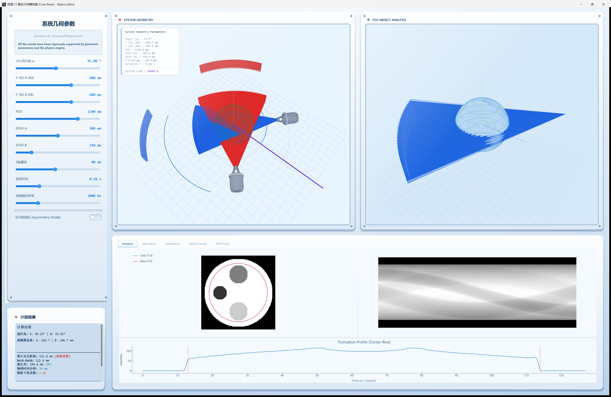
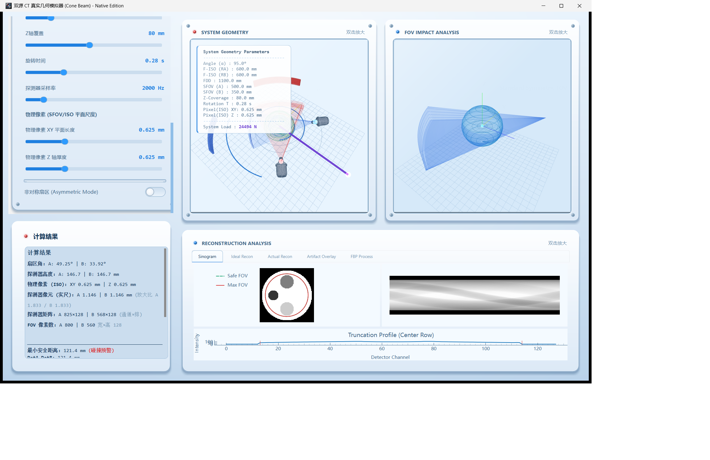
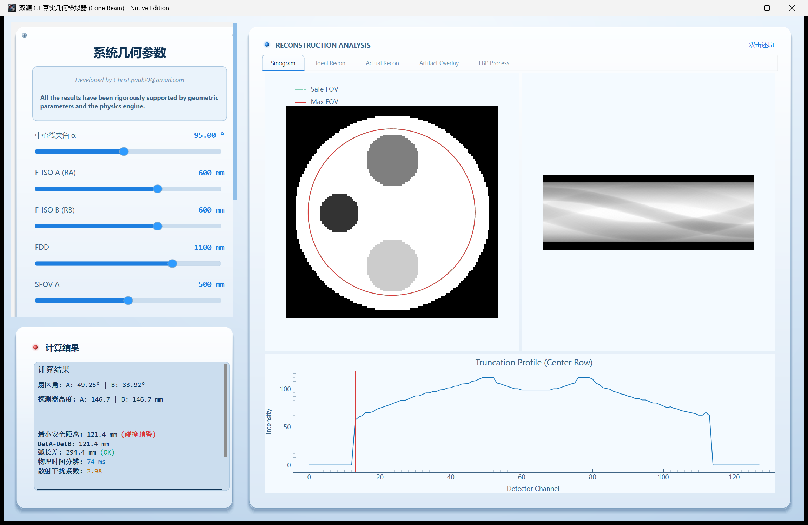
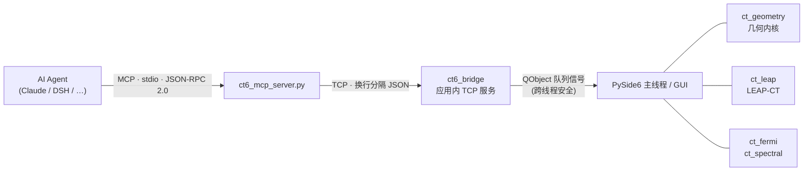

# 双源 CT 真实几何模拟器 · Native Edition

[](https://github.com/hg3992260/digital_ct_simulate/actions/workflows/windows-build.yml)

> 双源宽体 CT 的**几何 / 数据 / 重建数字孪生**：5 种 CT 架构 × LEAP-CT 物理重建 ×
> 半导体探测器响应（Fermi）× 严格多材料谱分解，并内置**面向 AI Agent 的控制桥（MCP）**，
> 让 Agent 能直接读写几何主参数、切换架构、跑重建、取截图。

不是"画个好看的示意图"，而是**从几何恒等式一路接到真实重建算子**的研发台：
左边栏改一个 `alpha`，扇形角、最小间距、螺旋螺距上限、探测器阵列整数化匹配、
剂量指数、时间分辨率会同时重算；点一下 FBP，走的是 LEAP-CT 的锥束/螺旋正投影与反投影。

---

## 界面预览

| 主界面（几何 / 重建 / 伪影） | FBP 重建流程 |
| :---: | :---: |
|  |  |

| 像素 / 等中心对位 | 重建窗口最大化 |
| :---: | :---: |
|  |  |

---

## 核心能力

- **五种 CT 架构**统一建模：双源、单源宽体、双层能谱、光子计数、静态多源阵列
- **几何内核**：扇形角 / 最小间距 / 180° 弧差安全校验、探测器阵列**整数化自动匹配**、
  Bowtie 滤过器、非对称准直、扫描协议闭环（剂量 / 时间分辨率 / 螺距上限）
- **真实重建**：LEAP-CT 1.26 —— 扇束 FBP、锥束 FBP、螺旋（360LI / 180LI / 180MF 插值）、
  模块束（静态阵列）+ SART / ASDPOCS 迭代、短扫描 Parker 加权
- **探测器物理**：CZT / TlBr 等半导体响应的深度加权 CCE、能量箱匹配、双层叠加
- **谱分解**：逐能量正投影 + 非线性牛顿法，输出基材料分解与有效 μ
- **Agent 原生**：应用内 TCP 控制桥 + MCP stdio 服务器，Agent 可脚本化一切

---

## 五种 CT 架构

| 架构 key | 源数 | 能量维 | 旋转 | 说明 |
| :--- | ---: | ---: | :---: | :--- |
| `dual_source` | 2 | 1 | ✅ | 双源，两套系统按 `alpha` 夹角同时采样 |
| `single_wide` | 1 | 1 | ✅ | 单源宽体，靠大锥角覆盖 |
| `dual_layer` | 1 | 2 | ✅ | 双层探测器能谱（2 层） |
| `pcct` | 1 | 8 | ✅ | 光子计数（8 能量箱），配合 Fermi 响应 |
| `static_multi` | 24 | 1 | ❌ | 静态多源环形阵列，每个源一个视角 |

架构不只是"标签"：它直接决定采样几何。旋转架构按 `views_per_rot × n_src` 计视角数；
静态架构不旋转，`180°` 对应的是**一半源数**（`static_src_180 = round(n_src/2)`），
并额外给出 `static_src_short / static_src_used / static_span_deg / static_ok_180`
用于判断短扫描可用性。

---

## 快速开始

### 方式 A：下载 Windows 可执行文件（推荐）

**Actions → [`windows-build`](https://github.com/hg3992260/digital_ct_simulate/actions/workflows/windows-build.yml)
→ 最新一次成功 run → Artifacts → `DSW_CT_Windows`**，解压后直接运行 `DSW_CT.exe`。

> 产物已内含 CUDA 运行时，且构建流程带**冻结环境自检**（真的 import 全部模块并构造一次
> LEAP 引擎），所以不会出现"构建绿了但一跑就崩"的包。

### 方式 B：源码运行

```bat
:: 需要 Python 3.11
pip install -r requirements.txt
run.bat
```

或

```bat
python src\simulate_ct6.py
```

`run.bat` 会把 `src/`、`vendor/leapct`、`vendor/xraylib`、`vendor/cuda` 一起加进 `PYTHONPATH`。

---

## 目录结构

```
src/
  simulate_ct6.py      主程序（PySide6 + PyCt6 界面，3285 行）
  ct_geometry.py       几何内核：5 架构 / 阵列整数化匹配 / Bowtie / 协议闭环
  ct_leap.py           LEAP-CT 引擎：扇束 / 锥束 / 模块束+迭代 / 螺旋 / 短扫描
  ct_helical.py        螺旋 z 插值（360LI / 180LI / 180MF）
  ct_index.py          sinogram ↔ 探测器单元 ↔ 几何 解析索引 + z 重排
  ct_fermi.py          Fermi 半导体响应桥接（深度加权 CCE / 能量箱 / 双层）
  ct_spectral.py       严格多材料谱分解（逐能量正投影 + 非线性牛顿）
  ct_scene.py          3D 场景与伪影可视化
  ct6_bridge.py        应用内 TCP 控制桥（Agent 入口）
  ct6_mcp_server.py    MCP stdio 服务器（5 个工具）
  frozen_entry.py      PyInstaller 打包入口 + 冻结环境自检
  legacy/              早期 PyQt5 版本（保留参考，不再维护）
scripts/
  build_windows.ps1    Windows 打包脚本（workflow 只负责调用它）
  collect_cuda.py      从 nvidia wheel 收集 CUDA 运行时 DLL
  make_icon.py         由 assets/LOGO.jpg 生成 assets/logo.ico
assets/                logo / 图标 / 启动图
docs/                  界面截图
Fermi/                 半导体探测器响应模拟子项目（ct_fermi 依赖其 src/）
vendor/leapct/         LEAP-CT 1.26（leapctype.py + libleapct.dll 18MB）
vendor/xraylib/        xraylib 4.3.0（xraylib.py + 两个 pyd，29MB）
vendor/cuda/           仓库只带 cudart64_12.dll，其余由构建脚本补齐
```

---

## 几何内核要点

### 探测器阵列整数化自动匹配

物理上通道数与排数必须是整数，但由弧长/覆盖反推往往得到小数。内核的做法是
**先算出理想值，再取整，再用取整结果反解真实像素间距**，保证几何自洽：

```
n_ch_ideal = arc / pixel_xy          n_ch   = round(n_ch_ideal)
n_rows     = round(Z_coverage / pixel_z)

col_pitch   = arc / n_ch                          # 反解，替代名义 pixel_xy
row_pitch_iso = Z_coverage / n_rows
row_pitch_det = row_pitch_iso × FDD / RA           # 投影到探测器平面
array_total   = n_ch × n_rows
```

默认参数（`alpha=95°`、`RA=RB=600`、`FDD=1100`、`Z=160`、`pixel_z=0.625`）下：

```
n_ch = 825        col_pitch = 1.1461 mm      array_residual_px = (0.169, 0.0)
n_rows = 256      row_pitch_iso = 0.625 mm   array_ok = True
array_total = 211200
```

`array_residual_px` 是取整残差（单位：像素），`array_ok` 是"整数化后仍满足视场要求"的判据。
也可用 `n_ch_set` 手动钉死通道数（`n_ch_manual`）。

### 其它同步回算量

`alpha / RA / RB / FDD / SFOV_A / SFOV_B` 一改，下列量全部重算：
扇形角 A/B、最小间距 `min_dist`（安全阈值 150 mm）、180° 弧差 `arc_diff`（阈值 120°）、
`is_safe` / `is_arc_ok`、几何效率 `beta_A/beta_B`、`kappa`、探测器高度 `H_det_A/B`、
螺距上限（双源/单源分别一个）、`ctdi_rel` 剂量指数、`t_res_arch_ms` 时间分辨率、
`slices` / `views_total` / `data_cells` 等。

---

## 重建后端：LEAP-CT

`ct_leap.py` 把 LEAP-CT 1.26 的 C++ 算子接成 Python 侧的统一接口：

- `FanGeometry` 直接采用内核算出的 `n_ch / n_rows / col_pitch / row_pitch_det / array_total`
- 锥束：`set_conebeam(...)` + 曲面探测器；螺旋用 `set_helicalPitch()`
- 静态阵列：`set_modularbeam(...)`（模块束）→ 解析重建或 SART / ASDPOCS
- 短扫描：< 360° 时走手工 FBP 链（`preRampFiltering → rampFilterProjection →
  postRampFiltering → weightedBackproject`）并叠 Parker 加权

> ⚠️ **`helicalPitch` 的单位是 mm/弧度**（LEAP 约定），不是"每圈进给比"。
> 代码内已按 `pitch × Z_cov / (2π)` 换算；这是最容易静默出错的一处。

---

## 探测器物理：Fermi 子项目

`Fermi/` 是一个独立的半导体探测器响应模拟器（CZT / TlBr / CdTe / Si / GaAs …）。
`ct_fermi.py` 负责桥接，向主程序提供：

- 材料参数与载流子输运剖面（`get_transport_profile()`）
- 深度加权 CCE（电荷收集效率）与权重场
- 能量箱响应矩阵 / 源谱 / 箱权重 → 光子计数与双层架构的分箱展开
- 电场剖面（`get_electric_field_profile()`）

Fermi 的 `src/` 内部使用顶层导入（`from src.material import ...`），因此
`ct_fermi` 需要把 `Fermi/` 与 `Fermi/src/` 都加进 `sys.path` —— 打包时也必须把
`Fermi/` 作为**真实目录**带上，不能只丢进 PYZ。

---

## 谱分解

`ct_spectral.py` 做严格多材料分解：

- μ 表优先用 **xraylib**；水等材料改用**元素加权**构造（pip wheel 常缺化合物表，
  `CS_Total_CP('Water', E)` 会直接报错）
- `per_energy_sinograms` 逐能量正投影，`bin_from_energy_maps` 按箱聚合
- `decompose`（线性化）与 `decompose_newton`（逐射线 2 参数牛顿，显式 2×2 正规方程，
  回传残差）
- 谱与响应在能量网格上做**单元积分**（`spectrum_on_grid` / `response_on_grid`）

精度演进（碘浓度回收，真值 10 mg/mL 量级）：

| 方法 | 相对误差 |
| :--- | ---: |
| 线性化分解 | 57.5% |
| 非线性牛顿 | 10.4%（残差 4.9e-07） |
| 牛顿 + 逐像素 Lᵢ/L_w 比值标定 | **6.1%** |

---

## AI Agent 控制（MCP）

### 控制链路



程序启动时把监听端口写进发现文件 `ct6_bridge.json`，Agent 侧读它即可连上 ——
所以 **Agent 不需要知道端口号**，只要程序在跑。

### 工具集（1 通用 + 4 高频）

| 工具 | 作用 |
| :--- | :--- |
| `ct6_call(op, params)` | 通用调用，`op ∈ {ping, list, get, set, arch, scan, fbp, fermi, shot, view}` |
| `ct6_set_geometry(**params)` | 写几何/扫描方案参数（`alpha, RA, RB, FDD, SFOV_A/B, Z_coverage, rotation_time, sampling_rate, pixel_xy, pixel_z, n_ch_set, bowtie_sfov, bowtie_edge, pitch, scan_length, slice_thickness, slice_interval, shots_per_source, nch_auto_sw, asymmetric_cb, scan_mode`） |
| `ct6_switch_arch(arch)` | 切换架构：`dual_source \| single_wide \| dual_layer \| pcct \| static_multi` |
| `ct6_run_fbp(settle_ms)` | 执行 FBP 重建并等待落定 |
| `ct6_screenshot()` | 回传窗口截图（MCP image 内容） |

`list` 列出全部可写输入变量，`get` 额外回传上百项派生结果（数量随架构与页签可见性变化）。
**写变量没有白名单**——包括 `alpha / RA / RB / FDD` 这些几何主参数，Agent 都能直接改。

### 接入配置

```json
{
  "mcpServers": {
    "ct6": {
      "command": "D:\\python\\envs\\mar\\python.exe",
      "args": ["I:\\dsw\\digital_ct_simulate\\src\\ct6_mcp_server.py"]
    }
  }
}
```

前提：仿真程序已启动（否则工具会返回"未连接：仿真程序未运行或发现文件缺失"）。

### 自检

```bat
echo {"jsonrpc":"2.0","id":1,"method":"tools/list"} | python src\ct6_mcp_server.py
```

---

## 构建与发布

CI 只做三件事：装依赖 → 调 `scripts/build_windows.ps1` → 上传产物。
**所有构建参数都在仓库脚本里**（不是 workflow 里），改构建不用动 workflow。

```bat
:: 本地复现同一套构建 + 自检
pwsh -File scripts\build_windows.ps1
```

脚本会依次：

1. `scripts/collect_cuda.py` —— 从 nvidia wheel 收集 CUDA 运行时到 `vendor/cuda/`
2. `scripts/make_icon.py` —— 由 `assets/LOGO.jpg` 现生成 `assets/logo.ico`
3. PyInstaller `--onedir` 打包（含 `--icon`、`--copy-metadata`、`--add-data vendor/*`）
4. **冻结环境自检**：在产物内部 import 全部关键模块并构造一次 LEAP 引擎，失败即构建失败

> 本仓库的 `.ps1` 必须保存为 **UTF-8 with BOM**：Windows PowerShell 5.1 会把无 BOM
> 文件按 ANSI(GBK) 解码，中文注释会变成乱码并抛 `ParserError`。

---

## 依赖与 CUDA

- **Python 3.11**（`libleapct` / `xraylib` 的扩展都是 `cp311`）
- `pip install -r requirements.txt`
- **LEAP-CT / xraylib 不走 pip**：已在 `vendor/` 内附带，启动脚本会加进 `sys.path`
- **CUDA**：`libleapct.dll` 是 CUDA 版。按 PE 导入表实测，它直接依赖
  **`cufft64_11.dll`**（后者又依赖 `nvJitLink_120_0.dll` / `nvrtc64_120_0.dll`）
  与显卡驱动自带的 `nvcuda.dll`；**并不需要 cublas / cusparse**。
  这些库体积过大（cufft 单个约 274 MB，超过 GitHub 单文件 100 MB 限制），
  故仓库只带一个 `cudart64_12.dll`：
  - 源码运行：安装 CUDA 12 运行时并加入 `PATH`，或在程序中切 `set_GPU(-1)` 走 CPU
  - 打包：`scripts/collect_cuda.py` 会从 nvidia wheel 自动取齐，本机无需装 CUDA

---

## 排错

| 症状 | 原因 / 处理 |
| :--- | :--- |
| `ModuleNotFoundError: No module named 'PyQt5'` | 你拿到的是**旧原型**产物。本程序的界面是 PySide6 + PyCt6；PyQt5 版本已移到 `src/legacy/` 且不再构建 |
| 程序能启动，但显示 **"LEAP-CT 不可用"** | 打包时漏了 `--copy-metadata imageio --copy-metadata lazy_loader`。`imageio/__init__.py` 在 import 期读自己的 dist-info 取版本号，PyInstaller 默认不打 `.dist-info`，于是 `import leapctype` 抛 `PackageNotFoundError` |
| exe 图标是 PyInstaller 的默认图标 | 打包时没传 `--icon`。见 `scripts/make_icon.py` |
| CI：`ParserError: Missing expression after unary operator '--'` | 在 GitHub Windows runner 的 `run:`（默认 **PowerShell**）里用了 cmd 的 `^` 续行符。参数应写成数组或整行 |
| CI：`NativeCommandError` 紧跟 PyInstaller 第一行 INFO | PowerShell 5.1 在 `$ErrorActionPreference='Stop'` 下会把原生命令的 stderr 当终止错误。见脚本里的 `Invoke-Native` |
| 本地跑 `.ps1`：`Unexpected token '}'` | `.ps1` 丢了 UTF-8 BOM，被按 GBK 解码 |
| `import leapctype` 失败但文件都在 | 检查 `vendor/leapct` 是否作为**真实目录**打进了产物（`leapctype` 靠 `__file__` 定位 `libleapct.dll`，不能只在 PYZ 里） |
| Fermi 相关功能静默失效 | `Fermi/` 需作为真实目录随产物发布；`ct_fermi` 要把 `Fermi/` 与 `Fermi/src/` 加进 `sys.path` |

---

## 已知限制

- 螺旋 `helicalPitch` 为 **mm/rad**（LEAP 约定），代码内已按 `每圈进 mm / 2π` 换算
- 谱分解的碘浓度误差约 **6%**（逐像素比值标定后）；主要残差来自 FBP 域边缘伪影
- 静态多源提供"等效旋转锥束"与"模块束 + SART"两条路径；xraylib 化合物表缺失，
  改用元素加权构造 μ
- `src/legacy/` 的 PyQt5 版本仅作历史参考，不再构建、不再修复
- 仓库尚未附带 `LICENSE`

---

## 致谢

- **[LEAP-CT](https://github.com/LLNL/LEAP)**（LLNL，MIT）—— 锥束 / 螺旋 / 模块束投影与重建算子
- **[xraylib](https://github.com/tschoonj/xraylib)** —— 元素与化合物的 X 射线衰减截面
- **[PyCt6](https://pypi.org/project/PyCt6/)** —— 主题化 PySide6 组件库
